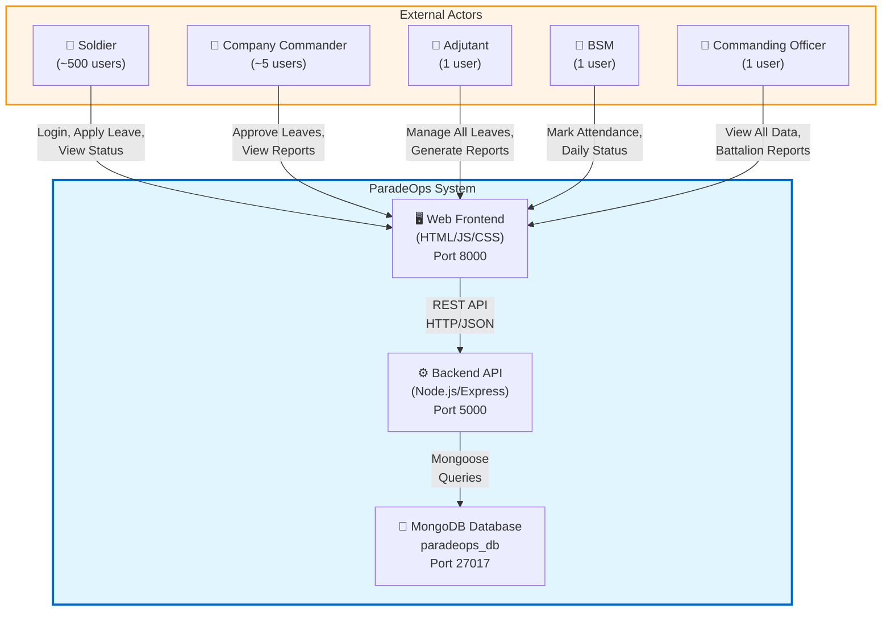
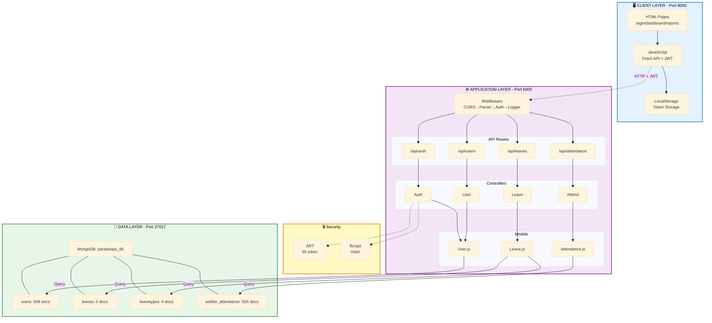
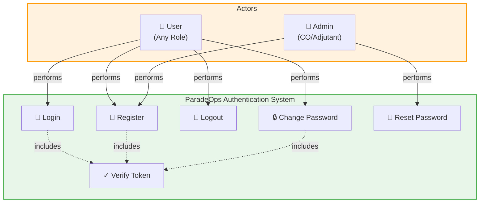
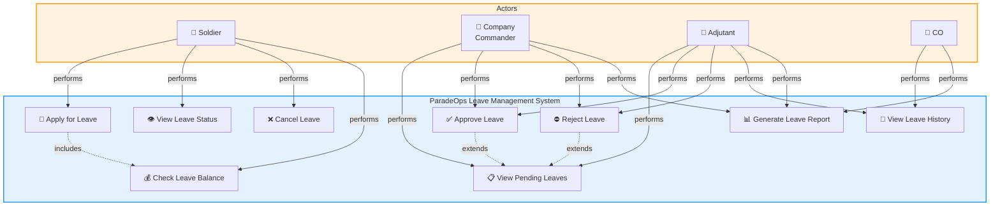
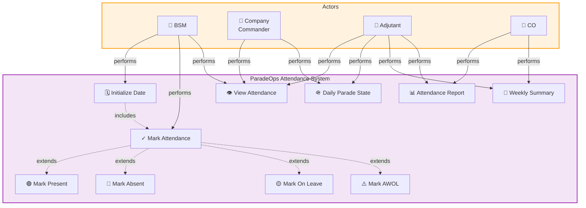
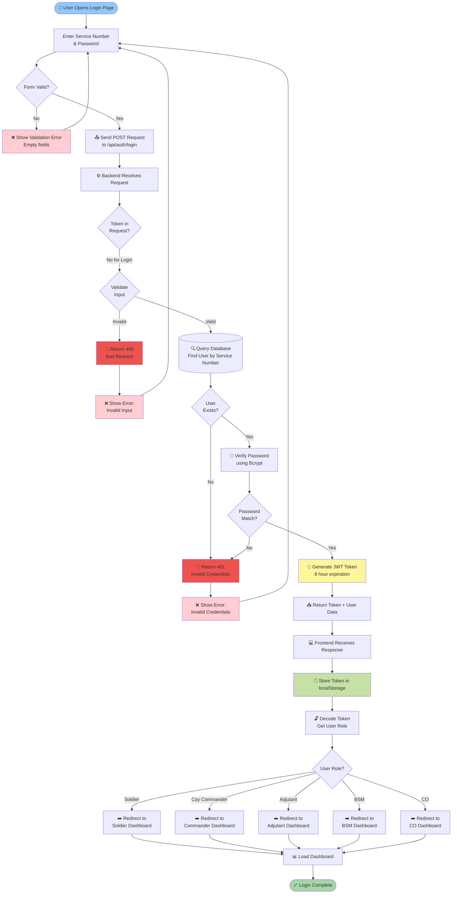

# ParadeOps - System Diagrams
## Context, Use Case & Activity Diagrams

---

## Table of Contents
1. [System Context Diagram](#1-system-context-diagram)
2. [Use Case Diagrams (3 Topics)](#2-use-case-diagrams)
   - 2.1 User Authentication System
   - 2.2 Leave Management System
   - 2.3 Attendance Tracking System
3. [Activity Diagrams (3 Topics)](#3-activity-diagrams)
   - 3.1 User Login Process
   - 3.2 Leave Application & Approval
   - 3.3 Daily Attendance Marking

---

## 1. System Context Diagram

### Overview
System Context Diagram দেখায় ParadeOps system কীভাবে external entities এর সাথে interact করে।

**Explanation:**
- **External Actors:** 5 different user roles যারা system ব্যবহার করে
- **ParadeOps System:** 3-tier architecture (Frontend → Backend → Database)
- **Interactions:** Users web interface এর মাধ্যমে system access করে

---

## 1.1 Detailed System Architecture Diagram (A4 Optimized)

### Overview
এই diagram ParadeOps system এর internal architecture বিস্তারিতভাবে দেখায়। A4 page এর জন্য optimized।

**Architecture Components (Compact):**

| Layer | Component | Technology | Key Function |
|-------|-----------|------------|--------------|
| **Client** | HTML/JS | HTML5, ES6+ | User Interface |
| | LocalStorage | Browser API | Token Storage |
| **Application** | Middleware | CORS, Parser, Auth | Request Processing |
| | Routes | Express Router | 4 API endpoints |
| | Controllers | JavaScript | Business Logic |
| | Models | Mongoose | Data Schema |
| **Security** | JWT | jsonwebtoken | Authentication (8h) |
| | Bcrypt | bcryptjs | Password Hashing |
| **Database** | MongoDB | NoSQL | Data Storage (4 collections) |
| | Collections | users(508), leaves(0), leavetypes(4), attendance(505) | Records |

**Data Flow:** Client (HTTP+JWT) → Middleware → Routes → Controllers → Models → MongoDB → Response

**Security:** JWT (8h) + Bcrypt (10 rounds) + CORS + Validation + RBAC

---

### 📄 A4 Print/Export Tips

**For PDF Export:**
1. **VS Code:** Install Mermaid extension → Right-click diagram → Export as PNG/SVG → Convert to PDF
2. **Online:** Copy diagram to https://mermaid.live/ → Download PNG → Insert in document
3. **Browser:** Open in Chrome → Print → Save as PDF → Landscape orientation recommended

**For Document:** 
- Landscape orientation (A4 Horizontal) works best for wide diagrams
- Adjust zoom to 85-95% if diagram exceeds page margins
- Use "Fit to page" option in print settings

---

## 2. Use Case Diagrams

### 2.1 Use Case Diagram - User Authentication System

**Use Cases:**

| Use Case | Actor | Description |
|----------|-------|-------------|
| **Login** | All Users | Service number ও password দিয়ে login করা |
| **Register** | Admin/New User | নতুন user account তৈরি করা |
| **Logout** | All Users | System থেকে logout করা |
| **Change Password** | All Users | নিজের password পরিবর্তন করা |
| **Verify Token** | System | JWT token এর validity check করা |
| **Reset Password** | Admin | অন্য user এর password reset করা |

**Relationships:**
- `includes` relationship: Login, Register, Change Password সবই Verify Token include করে

---

### 2.2 Use Case Diagram - Leave Management System

**Use Cases:**

| Use Case | Actor | Description |
|----------|-------|-------------|
| **Apply for Leave** | Soldier | নতুন ছুটির আবেদন জমা দেওয়া |
| **View Leave Status** | Soldier | নিজের ছুটির status দেখা |
| **Cancel Leave** | Soldier | Pending leave cancel করা |
| **Check Leave Balance** | Soldier | কত দিন ছুটি বাকি আছে দেখা |
| **View Pending Leaves** | Commander/Adjutant | অনুমোদনের জন্য pending leaves দেখা |
| **Approve Leave** | Commander/Adjutant | ছুটি অনুমোদন করা |
| **Reject Leave** | Commander/Adjutant | ছুটি প্রত্যাখ্যান করা |
| **View Leave History** | Adjutant/CO | সব ছুটির ইতিহাস দেখা |
| **Generate Leave Report** | Commander/Adjutant/CO | ছুটি সংক্রান্ত রিপোর্ট তৈরি করা |

**Relationships:**
- `includes`: Apply Leave সবসময় Check Balance করে
- `extends`: Approve/Reject Leave হল View Pending এর extension

---

### 2.3 Use Case Diagram - Attendance Tracking System

**Use Cases:**

| Use Case | Actor | Description |
|----------|-------|-------------|
| **Initialize Date** | BSM | দিনের জন্য attendance record তৈরি করা |
| **Mark Attendance** | BSM | সিপাহীদের উপস্থিতি চিহ্নিত করা |
| **Mark Present** | BSM | সিপাহী উপস্থিত চিহ্নিত করা |
| **Mark Absent** | BSM | সিপাহী অনুপস্থিত চিহ্নিত করা |
| **Mark On Leave** | BSM | সিপাহী ছুটিতে চিহ্নিত করা |
| **Mark AWOL** | BSM | AWOL (অনুমতি ছাড়া অনুপস্থিত) চিহ্নিত করা |
| **View Attendance** | All | উপস্থিতি রেকর্ড দেখা |
| **Daily Parade State** | Commander/Adjutant | দৈনিক প্যারেড স্টেট রিপোর্ট |
| **Weekly Summary** | Adjutant/CO | সাপ্তাহিক সারসংক্ষেপ |
| **Attendance Report** | Adjutant/CO | বিস্তারিত উপস্থিতি রিপোর্ট |

**Relationships:**
- `includes`: Initialize Date সবসময় Mark Attendance include করে
- `extends`: Mark Present/Absent/Leave/AWOL সব Mark Attendance এর extension

---

## 3. Activity Diagrams

### 3.1 Activity Diagram - User Login Process

**Activity Diagram বর্ণনা:**

1. **Start:** User login page এ যায়
2. **Input:** Service number ও password enter করে
3. **Validation:** Client-side form validation
4. **API Call:** Backend এ POST request পাঠায়
5. **Server Validation:** Input validation করে
6. **Database Query:** User খুঁজে বের করে
7. **Password Check:** Bcrypt দিয়ে password verify করে
8. **Token Generation:** JWT token তৈরি করে
9. **Response:** Token frontend এ পাঠায়
10. **Storage:** localStorage এ token save করে
11. **Decode:** Token decode করে role জানে
12. **Redirect:** Role অনুযায়ী appropriate dashboard এ redirect করে
13. **End:** Dashboard load হয়

**Decision Points:**
- Form valid কিনা?
- User exist করে কিনা?
- Password match করে কিনা?
- User এর role কী?

---

### 3.2 Activity Diagram - Leave Application & Approval Process

```mermaid
flowchart TD
    Start([👤 Soldier Wants Leave]) --> OpenForm[📝 Open Leave Application Form]
    OpenForm --> FetchTypes[📥 Fetch Leave Types<br/>GET /api/leaves/types]
    FetchTypes --> PopulateDD[📋 Populate Dropdown<br/>Annual, Casual, Rec, Med]
    
    PopulateDD --> FillForm[✍️ Fill Leave Application Form]
    FillForm --> FillDetails[Enter:<br/>• Leave Type<br/>• Start Date<br/>• End Date<br/>• Reason<br/>• Contact<br/>• Address]
    
    FillDetails --> CalcDays[🔢 Auto-calculate<br/>Total Days]
    CalcDays --> ValidateForm{Form<br/>Validation}
    
    ValidateForm -->|Invalid| ShowError1[❌ Show Errors<br/>Missing fields]
    ShowError1 --> FillForm
    
    ValidateForm -->|Valid| CheckDays{Total Days <<br/>Max Days?}
    CheckDays -->|No| ShowError2[❌ Error: Days Exceed<br/>Maximum Limit]
    ShowError2 --> FillForm
    
    CheckDays -->|Yes| SubmitApp[📤 Submit Application<br/>POST /api/leaves]
    SubmitApp --> BackendReceive[⚙️ Backend Receives]
    
    BackendReceive --> ExtractToken[🎫 Extract User from JWT]
    ExtractToken --> ValidateBackend{Backend<br/>Validation}
    
    ValidateBackend -->|Failed| Return400[🔴 Return 400<br/>Validation Error]
    Return400 --> ShowError3[❌ Display Error]
    ShowError3 --> FillForm
    
    ValidateBackend -->|Passed| CheckUser{User<br/>Exists?}
    CheckUser -->|No| Return404[🔴 Return 404<br/>User Not Found]
    Return404 --> ShowError3
    
    CheckUser -->|Yes| CheckLeaveType{Leave Type<br/>Valid?}
    CheckLeaveType -->|No| Return404
    
    CheckLeaveType -->|Yes| CreateLeave[(💾 Create Leave Record<br/>Status: Pending)]
    CreateLeave --> ReturnSuccess[✅ Return Success]
    ReturnSuccess --> ShowSuccess[🎉 Show Success Message]
    ShowSuccess --> RedirectDash[➡️ Redirect to Dashboard]
    
    RedirectDash --> WaitApproval[⏳ Leave Status: Pending]
    
    WaitApproval --> CmdrLogin[👤 Commander Logs In]
    CmdrLogin --> OpenApproval[📋 Open Leave Approval Page]
    OpenApproval --> FetchPending[📥 Fetch Pending Leaves<br/>GET /api/leaves?status=pending]
    
    FetchPending --> FilterCompany[🔍 Filter by Company<br/>Role-based filtering]
    FilterCompany --> DisplayList[📃 Display Pending List]
    
    DisplayList --> CmdrReview{Commander<br/>Reviews}
    
    CmdrReview -->|Reject| ClickReject[⛔ Click Reject Button]
    ClickReject --> EnterReason[✍️ Enter Rejection Reason]
    EnterReason --> SendReject[📤 PUT /api/leaves/:id/reject]
    SendReject --> UpdateStatusRej[(💾 Update Status:<br/>Rejected)]
    UpdateStatusRej --> NotifySoldierRej[📧 Notify Soldier]
    NotifySoldierRej --> EndRej([❌ Leave Rejected])
    
    CmdrReview -->|Approve| ClickApprove[✅ Click Approve Button]
    ClickApprove --> SendApprove[📤 PUT /api/leaves/:id/approve]
    SendApprove --> UpdateStatusApp[(💾 Update Status:<br/>Approved<br/>Set approved_by)]
    
    UpdateStatusApp --> NotifySoldier[📧 Notify Soldier]
    NotifySoldier --> SoldierChecks[👤 Soldier Checks Dashboard]
    SoldierChecks --> SeeApproved[👁️ Sees Status: Approved]
    SeeApproved --> End([✅ Leave Approved])
    
    style Start fill:#90caf9
    style End fill:#a5d6a7
    style EndRej fill:#ef9a9a
    style Return400 fill:#ef5350
    style Return404 fill:#ef5350
    style ShowError1 fill:#ffcdd2
    style ShowError2 fill:#ffcdd2
    style ShowError3 fill:#ffcdd2
    style CreateLeave fill:#fff59d
    style UpdateStatusApp fill:#c5e1a5
    style UpdateStatusRej fill:#ffccbc
    style ShowSuccess fill:#c8e6c9
```

**Activity Diagram বর্ণনা:**

**Phase 1: Application (Soldier)**
1. Leave application form open করে
2. Leave types fetch করে (API call)
3. Form fill করে (type, dates, reason, contact, address)
4. Total days auto-calculate হয়
5. Validation check করে
6. Submit করে (POST /api/leaves)
7. Backend এ record তৈরি হয় (status: pending)
8. Success message দেখায়

**Phase 2: Approval (Commander)**
9. Commander login করে
10. Pending leaves page open করে
11. Pending leaves fetch করে (filtered by company)
12. List display হয়
13. Commander review করে

**Decision Point:**
- **Approve:** Status update হয় "approved", soldier কে notify করা হয়
- **Reject:** Rejection reason enter করে, status "rejected" হয়

**Phase 3: Notification (Soldier)**
14. Soldier dashboard check করে
15. Updated status দেখে (Approved/Rejected)

**Parallel Paths:**
- Approval Path → ✅ Leave Approved
- Rejection Path → ❌ Leave Rejected

---

### 3.3 Activity Diagram - Daily Attendance Marking Process

```mermaid
flowchart TD
    Start([👤 BSM Starts Duty]) --> OpenDash[📊 Open BSM Dashboard]
    OpenDash --> CheckDate{Today's<br/>Attendance<br/>Initialized?}
    
    CheckDate -->|No| InitDate[🗓️ Initialize Today<br/>POST /api/attendance/init-date]
    InitDate --> FetchSoldiers[📥 Fetch All Soldiers<br/>GET /api/users?role=soldier]
    FetchSoldiers --> CreateRecords[(💾 Create Blank Records<br/>for Each Soldier)]
    CreateRecords --> DisplayForm
    
    CheckDate -->|Yes| DisplayForm[📋 Display Attendance Form]
    
    DisplayForm --> ShowList[📃 Show Soldier List<br/>with Checkboxes]
    ShowList --> ParadeTime{Which<br/>Activity?}
    
    ParadeTime -->|Morning PT| MorningPT[🌅 Morning PT Section]
    ParadeTime -->|Office| Office[🏢 Office Section]
    ParadeTime -->|Games| Games[⚽ Games Section]
    ParadeTime -->|Roll Call| RollCall[🌙 Roll Call Section]
    
    MorningPT --> SelectSoldier1[👤 BSM Selects Soldier]
    Office --> SelectSoldier1
    Games --> SelectSoldier1
    RollCall --> SelectSoldier1
    
    SelectSoldier1 --> CheckStatus{Soldier<br/>Status?}
    
    CheckStatus -->|Present| MarkPresent[✅ Check Present Box]
    CheckStatus -->|Absent| MarkAbsent[❌ Leave Unchecked]
    CheckStatus -->|On Leave| CheckLeave{Check<br/>Approved<br/>Leave?}
    CheckStatus -->|On Duty| MarkOnDuty[🚗 Mark On Duty]
    
    CheckLeave -->|Yes| AutoMarkLeave[🟡 Auto-mark On Leave]
    AutoMarkLeave --> SaveRecord
    CheckLeave -->|No| MarkAbsent
    
    MarkPresent --> SaveRecord[💾 Auto-save to DB<br/>POST /api/attendance/mark]
    MarkAbsent --> SaveRecord
    MarkOnDuty --> SaveRecord
    
    SaveRecord --> UpdateDB[(🗄️ Update MongoDB<br/>soldier_attendance)]
    UpdateDB --> UpdateUI[🔄 Update UI<br/>Visual Feedback]
    
    UpdateUI --> MoreSoldiers{More<br/>Soldiers?}
    
    MoreSoldiers -->|Yes| SelectSoldier1
    MoreSoldiers -->|No| CheckActivity{More<br/>Activities<br/>Today?}
    
    CheckActivity -->|Yes| ParadeTime
    CheckActivity -->|No| CalcStats[📊 Calculate Statistics]
    
    CalcStats --> CountStats[🔢 Count:<br/>• Total Present<br/>• Total Absent<br/>• On Leave<br/>• AWOL]
    
    CountStats --> DisplayStats[📈 Display Summary Stats]
    DisplayStats --> GenerateReport{Generate<br/>Daily Report?}
    
    GenerateReport -->|No| CheckSpecial{Mark Special<br/>Cases?}
    
    CheckSpecial -->|AWOL| MarkAWOL[⚠️ Mark AWOL<br/>Absent Without Leave]
    MarkAWOL --> UpdateDB
    
    CheckSpecial -->|Medical| MarkMedical[🏥 Mark Medical]
    MarkMedical --> UpdateDB
    
    CheckSpecial -->|No| End1([✅ Attendance Complete])
    
    GenerateReport -->|Yes| CreateReport[📄 Generate Daily Parade State]
    CreateReport --> AggregateData[📊 Aggregate Attendance Data]
    AggregateData --> FormatReport[📋 Format Report<br/>Company-wise Summary]
    
    FormatReport --> SendToCmdr[📤 Send to Commander]
    SendToCmdr --> End2([✅ Report Sent])
    
    End1 --> Notification
    End2 --> Notification
    
    Notification{Send<br/>Notifications?}
    Notification -->|Yes| NotifyAbsent[📧 Notify Absent Soldiers]
    NotifyAbsent --> NotifyCmdr[📧 Notify Commanders]
    NotifyCmdr --> FinalEnd([🏁 Process Complete])
    
    Notification -->|No| FinalEnd
    
    style Start fill:#90caf9
    style FinalEnd fill:#a5d6a7
    style End1 fill:#c8e6c9
    style End2 fill:#c8e6c9
    style CreateRecords fill:#fff59d
    style UpdateDB fill:#ffe082
    style MarkPresent fill:#c5e1a5
    style MarkAbsent fill:#ffccbc
    style AutoMarkLeave fill:#fff9c4
    style MarkAWOL fill:#ef9a9a
```

**Activity Diagram বর্ণনা:**

**Phase 1: Initialization**
1. BSM dashboard open করে
2. Check করে today's attendance initialize হয়েছে কিনা
3. যদি না হয়ে থাকে:
   - Initialize date API call করে
   - All soldiers এর জন্য blank records তৈরি করে
4. Attendance form display হয়

**Phase 2: Marking Attendance**
5. BSM activity select করে (Morning PT/Office/Games/Roll Call)
6. Soldier list দেখায় checkboxes সহ
7. প্রতিটি soldier এর জন্য:
   - **Present:** Check box ✅
   - **Absent:** Unchecked ❌
   - **On Leave:** Auto-detected & marked 🟡
   - **On Duty:** Special mark 🚗
8. প্রতিটি action auto-save হয় database এ
9. UI update হয় visual feedback সহ

**Phase 3: Statistics**
10. সব soldiers mark করার পর statistics calculate করা হয়:
    - Total Present
    - Total Absent
    - On Leave count
    - AWOL count
11. Summary display করা হয়

**Phase 4: Special Cases**
12. BSM special cases mark করে:
    - **AWOL:** Absent Without Leave (serious)
    - **Medical:** Medical reasons
13. Database update হয়

**Phase 5: Report Generation (Optional)**
14. Daily Parade State report generate করে
15. Company-wise summary তৈরি করে
16. Commander কে send করে

**Phase 6: Notifications (Optional)**
17. Absent soldiers কে notify করে
18. Commanders কে daily summary পাঠায়

**Decision Points:**
- Today initialized কিনা?
- Which activity marking?
- Soldier status কী?
- More soldiers আছে কিনা?
- More activities বাকি আছে কিনা?
- Report generate করবে কিনা?
- Notifications send করবে কিনা?

---

## Summary

### Diagrams Overview

| Diagram Type | Topic | Purpose |
|--------------|-------|---------|
| **Context Diagram** | Overall System | External actors ও system boundaries দেখায় |
| **Use Case 1** | Authentication System | Login/Register/Password management |
| **Use Case 2** | Leave Management | Leave application থেকে approval পর্যন্ত |
| **Use Case 3** | Attendance Tracking | Daily attendance marking workflow |
| **Activity 1** | User Login | Login process এর step-by-step flow |
| **Activity 2** | Leave Application | Soldier apply থেকে commander approval |
| **Activity 3** | Daily Attendance | BSM এর attendance marking process |

### Mermaid.js Usage

সব diagrams **Mermaid.js** এ লেখা। কীভাবে render করবেন:

1. **GitHub:** Markdown file এ automatic render হবে
2. **VS Code:** Mermaid extension install করুন
3. **Online:** https://mermaid.live/ এ paste করুন
4. **Documentation:** Any markdown viewer যা Mermaid support করে

### Diagram Features

✅ **Interactive:** Clickable nodes (supported viewers এ)  
✅ **Color-coded:** Different colors different states/actors দেখায়  
✅ **Comprehensive:** সম্পূর্ণ workflow covered  
✅ **Professional:** Project documentation/presentation এর জন্য ready  

---

**END OF SYSTEM DIAGRAMS**

এই diagrams আপনার SDP project documentation এ add করতে পারবেন!
